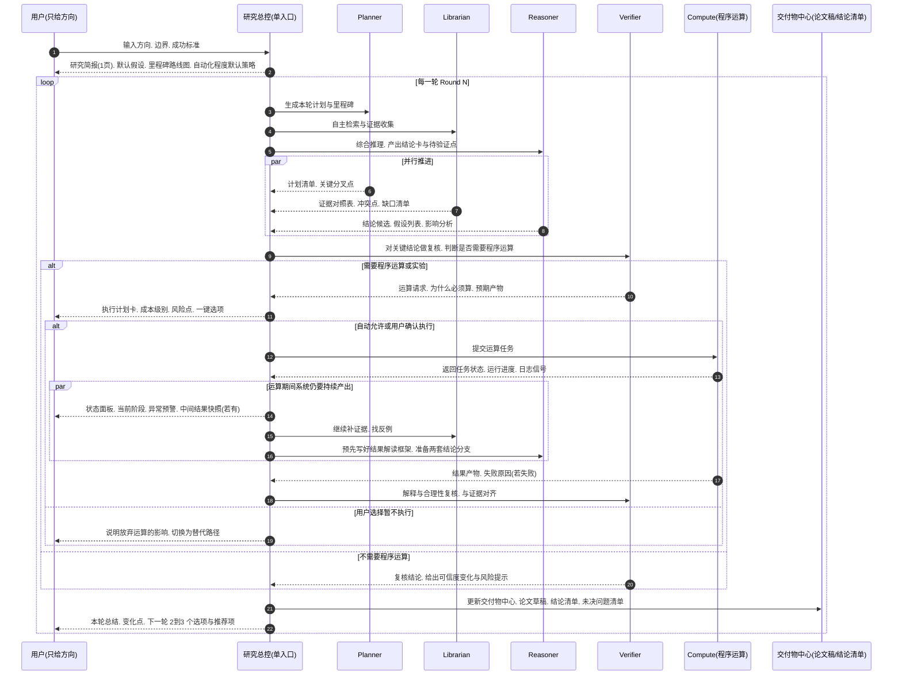

# 多轮 AI 研究助手系统 - 需求文档

> 系统需求规格说明

---

## 系统流程概览

```
┌──────────────────────────────────────────────────────────────┐
│ 0. 用户输入方向. 边界.                                       │
│    一句话方向 + 可选边界(预算/速度/严谨度/禁止项)            │
└──────────────────────────────────────────────────────────────┘
                              │
                              ▼
┌──────────────────────────────────────────────────────────────┐
│ 1. 系统回传. 研究简报(1页)                                   │
│    目的. 证明系统理解了用户的方向. 并把它变成可执行研究问题  │
│    用户看到什么.                                             │
│    1) 研究问题改写. 范围界定. 关键术语解释                   │
│    2) 默认假设清单. 风险清单. 不确定点清单                   │
│    3) 里程碑路线图. 预计每一轮会产出什么                     │
│    用户做什么. 只需点选. 继续 或 纠偏(改一两条假设/范围)     │
└──────────────────────────────────────────────────────────────┘
                              │
                              ▼
┌──────────────────────────────────────────────────────────────┐
│ 2. Round N 启动. 自主计划与并行调研                          │
│    用户看到什么.                                             │
│    1) 进度面板. 当前阶段. 正在做什么. 下一产物               │
│    2) 结论卡分层. 证据对照. 冲突点                            │
│    3) 执行计划卡(如果需要程序运算). 成本级别. 风险点. 一键选项 │
│    4) 中间结果快照(如果有). 让用户提前判断方向是否值得继续   │
│    5) 系统并行推进的其它工作. 继续找资料. 写论文草稿. 分析   │
│    用户能做什么.                                             │
│    随时中断. 改方向. 降预算. 切换为更保守路线. 不需要用户盯着│
└──────────────────────────────────────────────────────────────┘
                              │
                              ▼
┌──────────────────────────────────────────────────────────────┐
│ 3. 需要程序运算时. 执行计划卡弹出                             │
│    用户看到什么.                                             │
│    1) 运算描述. 要算什么. 预期产物                           │
│    2) 成本级别. 风险点                                       │
│    3) 失败替代方案                                           │
│    4) 三种选项: 执行. 降级. 暂不执行                         │
│    用户做什么. 一键选择                                       │
└──────────────────────────────────────────────────────────────┘
                              │
                              ▼
┌──────────────────────────────────────────────────────────────┐
│ 4. 程序运算运行中                                             │
│    用户看到什么.                                             │
│    1) 状态时间线. 当前阶段解释                                │
│    2) 日志摘要与异常预警                                      │
│    3) 中间结果快照(如果有)                                   │
│    4) 系统并行推进的其它工作                                  │
│    用户能做什么.                                             │
│    默认不操作. 必要时中断或改方向                             │
└──────────────────────────────────────────────────────────────┘
                              │
                              ▼
┌──────────────────────────────────────────────────────────────┐
│ 5. 计算完成. 结果回填. 解释. 复核                            │
│    用户看到什么.                                             │
│    1) 结果摘要. 关键图表或指标. 与预期对比                   │
│    2) 这对结论卡的影响. 哪些从待验证变为更可信. 哪些被推翻   │
│    3) 如果失败. 失败原因归类. 可选补救路径(重跑/换方法/放弃) │
└──────────────────────────────────────────────────────────────┘
                              │
                              ▼
┌──────────────────────────────────────────────────────────────┐
│ 6. 合并与交付中心更新                                        │
│    用户看到什么.                                             │
│    1) 本轮总结. 新增了什么. 改变了什么. 还不确定什么         │
│    2) 最新交付物中心. 最新论文稿. 结论清单. 证据对照. 下一步 │
│    3) 下一轮建议. 给用户 2 到 3 个高质量选项. 并给出推荐项   │
└──────────────────────────────────────────────────────────────┘
                              │
                              ▼
┌──────────────────────────────────────────────────────────────┐
│ 7. 进入 Round N+1. 持续迭代直至收敛或用户停止                │
└──────────────────────────────────────────────────────────────┘
```

---

## 多轮运行时序图

这个图更强调时间流逝感和并行性。时间从上往下。里面明确了什么时候会出现程序运算确认。运算期间系统应该持续给用户什么输出。



---

## 关键角色定义

| 角色 | 职责 |
|-----|------|
| **研究总控 (RA)** | 单入口协调者，接收用户输入，调度所有 Agent |
| **Planner** | 生成计划与里程碑 |
| **Librarian** | 自主检索与证据收集 |
| **Reasoner** | 综合推理，产出结论卡 |
| **Verifier** | 复核结论，判断是否需要程序运算 |
| **Compute** | 执行程序运算任务 |
| **交付物中心** | 论文稿、结论清单、证据对照 |

---

## 用户体验表

这张表不讲实现。只讲用户体验应该呈现什么。

| 阶段 | 用户看到的系统输出 | 用户需要的最小动作 | 目标 |
|-----|------------------|------------------|------|
| **输入方向后立刻** | 研究简报. 默认假设. 里程碑预告 | 继续或纠偏 | 防跑偏 |
| **并行调研中** | 进度面板. 正在做什么. 下一产物 | 可忽略 | 让用户有掌控感但不打扰 |
| **出现关键结论** | 结论卡分层. 证据对照. 冲突点 | 可选点评哪条最重要 | 快速判断可信度与优先级 |
| **需要程序运算时** | 执行计划卡. 要算什么. 预期产物. 成本级别. 风险点. 失败替代方案 | 一键选择. 执行. 降级. 暂不执行 | 只在必要时打扰用户 |
| **程序运算运行中** | 状态时间线. 当前阶段解释. 日志摘要与异常预警. 中间结果快照. 系统并行推进了什么 | 默认不操作. 必要时中断或改方向 | 让长任务不黑箱 |
| **运算完成后** | 结果摘要. 关键指标或图表. 对结论的影响. 若失败则给原因分类与补救选项 | 可选. 指定下一轮偏好 | 把计算变成推动结论收敛的证据 |
| **每轮结束** | 本轮总结. 新增与改变. 未决问题. 下一轮选项 | 继续或选方向/默认自动继续 直到这个方向已经agents判断没有任何需要执行的任务 | 形成持续迭代的科研节拍 |

---

## 程序运算确认机制

关于"程序是否需要确认"。从体验角度建议是分层策略，而不是一刀切。

### 核心原则

- **用户期待的自动化方向是对的。** 系统应默认在低成本低风险范围内自动算。
- 只有当运算显著提高成本。显著提高风险。或可能改变研究方向的关键结论时。才弹出执行计划卡让用户一键确认。
- 确认不应该变成讨论会。应该是一张卡片，三种选项，一句推荐理由。

### 执行计划卡内容

1. **运算描述**：要算什么，预期产物
2. **成本级别**：低/中/高
3. **风险点**：可能的风险
4. **失败替代方案**：如果失败怎么办
5. **三种选项**：
   - 执行（推荐）
   - 降级（切换到低成本方案）
   - 暂不执行（说明影响，切换替代路径）

---

## 沟通方式设计

### 双层结构

作为一种载体很合理。但不能把它当成唯一的沟通总线。最理想的是双层结构。

#### 论文作为主叙事。配套三类清单作为沟通骨架

可以把它理解成：论文是"面向人"。清单是"面向协作与推进"。

- **论文草稿负责：** 研究问题. 方法概览. 主要发现. 局限. 结论与建议。
- **配套清单至少应有三块：** 结论卡清单. 证据对照清单. 下一步任务清单。
- **agents 多轮沟通优先在清单里对齐。** 论文每轮只做高质量合并更新，让它始终可读。

### 体验优势

这种组合的体验好处是：
- 用户只要看论文就能把握全局
- 用户想深挖时再点开结论卡与证据对照
- 系统内部也不会因为论文越来越长而失控

---

## 详细功能需求

### 阶段 0: 用户输入

**输入项：**
- 研究方向（一句话描述）
- 可选边界：
  - 预算：low / medium / high
  - 速度：fast / normal / thorough
  - 严谨度：low / medium / high
  - 禁止项：列表

**验证规则：**
- 研究方向不能为空
- 研究方向长度限制（建议 1000 字以内）
- 边界参数合法性检查

### 阶段 1: 研究简报生成

**输出内容：**

1. **研究问题改写**
   - 将用户输入转化为可执行的研究问题
   - 明确研究范围
   - 解释关键术语

2. **默认假设清单**
   - 系统基于研究方向提出的假设
   - 每个假设可编辑/勾选
   - 支持用户纠偏

3. **风险清单**
   - 高风险、中风险、低风险分级显示
   - 每个风险有说明和缓解建议

4. **不确定点清单**
   - 系统不确定的地方
   - 需要后续验证的点

5. **里程碑路线图**
   - 预计每一轮会产出什么
   - 时间估算
   - 关键节点

**用户操作：**
- 继续：进入 Round 1
- 纠偏：修改假设/范围，重新生成简报

### 阶段 2: Round N 并行调研

**系统行为：**

1. **Planner 生成计划**
   - 生成本轮计划与里程碑
   - 识别关键分叉点
   - 输出计划清单

2. **Librarian 证据收集**
   - 自主检索相关文献/数据
   - 构建证据对照表
   - 识别冲突点和缺口

3. **Reasoner 综合推理**
   - 产出结论候选
   - 生成假设列表
   - 进行影响分析

4. **并行执行**
   - 三个 Agent 同时工作
   - 实时更新进度
   - 互不阻塞

**用户界面：**

1. **进度面板**
   - 当前阶段显示
   - 正在做什么
   - 下一产物预告

2. **结论卡分层显示**
   - 结论内容
   - 可信度标识
   - 证据链接
   - 支持用户点评

3. **证据对照表**
   - 证据列表
   - 冲突点高亮
   - 缺口清单

4. **中间结果快照**（如果有）
   - 让用户提前判断方向是否值得继续

5. **系统并行工作提示**
   - 显示系统在后台做什么
   - 继续找资料、写论文草稿、分析等

**用户操作：**
- 随时中断
- 改方向
- 降预算
- 切换为更保守路线
- 不需要用户盯着

### 阶段 3: 执行计划卡（需要程序运算时）

**触发条件：**
- Verifier 判断需要程序运算或实验
- 运算成本/风险超过阈值
- 可能改变研究方向的关键结论

**卡片内容：**

1. **运算描述**
   - 要算什么
   - 预期产物
   - 为什么必须算

2. **成本级别**
   - 低/中/高
   - 具体成本估算

3. **风险点**
   - 可能的风险
   - 风险等级

4. **失败替代方案**
   - 如果失败怎么办
   - 替代路径说明

5. **三种选项按钮**
   - 执行（推荐）
   - 降级（切换到低成本方案）
   - 暂不执行（说明影响，切换替代路径）

**用户操作：**
- 一键选择
- 不需要复杂讨论

### 阶段 4: 程序运算运行中

**系统行为：**

1. **提交运算任务**
   - Compute 接收任务
   - 返回任务状态
   - 运行进度更新
   - 日志信号推送

2. **运算期间系统持续产出**
   - Librarian 继续补证据、找反例
   - Reasoner 预先写好结果解读框架
   - 准备两套结论分支（成功/失败）

**用户界面：**

1. **状态时间线**
   - 当前阶段显示
   - 阶段解释

2. **日志摘要与异常预警**
   - 关键日志信息
   - 异常及时通知

3. **中间结果快照**（如果有）
   - 让用户提前判断

4. **系统并行工作提示**
   - 显示系统在做什么

**用户操作：**
- 默认不操作
- 必要时中断或改方向

### 阶段 5: 运算完成

**输出内容：**

1. **结果摘要**
   - 关键图表或指标
   - 与预期对比

2. **对结论卡的影响**
   - 哪些从待验证变为更可信
   - 哪些被推翻
   - 可信度变化

3. **失败处理**（如果失败）
   - 失败原因归类
   - 可选补救路径：
     - 重跑
     - 换方法
     - 放弃

**系统行为：**
- Verifier 解释与合理性复核
- 与证据对齐
- 更新结论卡

### 阶段 6: 交付中心更新

**输出内容：**

1. **本轮总结**
   - 新增了什么
   - 改变了什么
   - 还不确定什么

2. **最新交付物中心**
   - 最新论文稿
   - 结论清单
   - 证据对照
   - 下一步建议

3. **下一轮选项**
   - 给用户 2 到 3 个高质量选项
   - 给出推荐项
   - 说明推荐理由

**系统行为：**
- 更新论文草稿（高质量合并，保持可读）
- 更新结论卡清单
- 更新证据对照清单
- 更新下一步任务清单

### 阶段 7: Round N+1

**循环条件：**
- 持续迭代直至收敛
- 或用户停止

**收敛判断：**
- 系统判断没有需要执行的任务
- 结论已足够可信
- 用户主动停止

---

## 非功能需求

### 性能要求

- 研究简报生成时间：< 5s（P95）
- 单 Round 完成时间：< 60s（P95）
- WebSocket 消息延迟：< 200ms（P99）
- 结论卡渲染：首屏时间 < 1s

### 可用性要求

- 支持随时中断
- 支持改方向
- 支持降预算
- 支持切换保守路线
- 不需要用户盯着

### 可靠性要求

- Agent 响应超时自动重试（最多 3 次）
- 网络断开自动重连
- 浏览器刷新/关闭后会话可恢复
- 运算任务失败提供重试选项

### 安全性要求

- 输入过滤，防止注入攻击
- 运算任务权限校验
- 敏感数据脱敏
- 会话隔离

---

## 验收标准

### 功能验收

- [ ] 用户输入方向后，系统能生成研究简报
- [ ] 研究简报包含：问题改写、假设清单、风险清单、里程碑
- [ ] 用户点击继续后，能进入 Round 1
- [ ] Round N 启动后，Agent 能并行工作
- [ ] 结论卡能正确生成，包含内容、可信度、证据链接
- [ ] 需要程序运算时，能弹出执行计划卡
- [ ] 每轮结束能更新交付物中心
- [ ] 支持多轮迭代直至收敛或用户停止

### 体验验收

- [ ] 用户输入后立即看到研究简报（< 5s）
- [ ] 并行调研期间，用户有掌控感但不被打扰
- [ ] 程序运算期间，长任务不黑箱
- [ ] 每轮结束，用户能清楚看到变化和下一步选项

---

## 技术约束

### 架构约束

- 研究总控（RA）作为单入口协调者
- Agent 之间通过清单对齐，而非直接通信
- 论文作为主叙事，清单作为沟通骨架

### 数据约束

- 论文草稿每轮只做高质量合并更新
- 结论卡、证据对照、任务清单独立维护
- 支持历史 Round 记录查看

---

## 待定事项

1. **自动化程度默认策略**
   - 如何判断"低成本低风险"？
   - 阈值如何设定？

2. **收敛判断标准**
   - 如何判断"没有需要执行的任务"？
   - 结论可信度达到多少算收敛？

3. **多 Agent 协调机制**
   - 如何避免冲突？
   - 如何保证数据一致性？

4. **论文合并策略**
   - 如何高质量合并？
   - 如何保持可读性？

---

*文档版本: 1.0*  
*创建日期: 2026-01-12*  
*最后更新: 2026-01-12*

