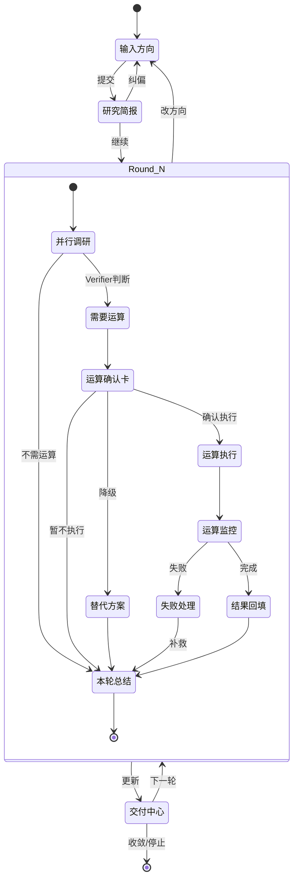

# 多轮 AI 研究助手系统 - 原型图

> 基于 [aevatarAI/aevatar-agent-framework#67](https://github.com/aevatarAI/aevatar-agent-framework/issues/67)

---

## 1. 整体流程图

```
┌─────────────────────────────────────────────────────────────────────────────┐
│                           用户旅程总览                                        │
├─────────────────────────────────────────────────────────────────────────────┤
│                                                                             │
│   ┌──────────┐    ┌──────────┐    ┌──────────┐    ┌──────────┐             │
│   │  输入    │───▶│  简报    │───▶│  调研    │───▶│  交付    │             │
│   │  方向    │    │  确认    │    │  迭代    │    │  收敛    │             │
│   └──────────┘    └──────────┘    └────┬─────┘    └──────────┘             │
│        │               │               │               ▲                    │
│        │               │               ▼               │                    │
│        │               │         ┌──────────┐          │                    │
│        │               │         │  运算    │──────────┘                    │
│        │               │         │  确认    │                               │
│        │               │         └──────────┘                               │
│        │               │                                                    │
│        │          [纠偏] ◀─────────────────────────────────────────────────│
│        │                                                                    │
│   [随时可中断/改方向]                                                        │
│                                                                             │
└─────────────────────────────────────────────────────────────────────────────┘
```

---

## 2. 状态机图



---

## 3. 页面原型图

### 3.1 阶段 0：输入方向

```
┌─────────────────────────────────────────────────────────────────────────────┐
│  🔬 AI 研究助手                                           [历史] [设置]     │
├─────────────────────────────────────────────────────────────────────────────┤
│                                                                             │
│  ┌───────────────────────────────────────────────────────────────────────┐  │
│  │                                                                       │  │
│  │  📝 输入你的研究方向                                                   │  │
│  │                                                                       │  │
│  │  ┌─────────────────────────────────────────────────────────────────┐  │  │
│  │  │                                                                 │  │  │
│  │  │  研究大语言模型在代码生成领域的最新进展，重点关注               │  │  │
│  │  │  Prompt Engineering 技术和 Agent 架构设计...                   │  │  │
│  │  │                                                                 │  │  │
│  │  │                                                                 │  │  │
│  │  └─────────────────────────────────────────────────────────────────┘  │  │
│  │                                                                       │  │
│  │  ⚙️ 研究边界（可选）                                                   │  │
│  │  ┌───────────────────────────────────────────────────────────────┐    │  │
│  │  │                                                               │    │  │
│  │  │  💰 预算级别      ○ 低  ● 中  ○ 高                            │    │  │
│  │  │                                                               │    │  │
│  │  │  ⚡ 速度偏好      ○ 快速  ● 标准  ○ 深度                       │    │  │
│  │  │                                                               │    │  │
│  │  │  📊 严谨度        [====●=====] 5/10                           │    │  │
│  │  │                                                               │    │  │
│  │  │  🚫 禁止项        [不涉及医疗、金融领域              ]         │    │  │
│  │  │                                                               │    │  │
│  │  └───────────────────────────────────────────────────────────────┘    │  │
│  │                                                                       │  │
│  │                                    ┌─────────────────┐                │  │
│  │                                    │  🚀 开始研究    │                │  │
│  │                                    └─────────────────┘                │  │
│  │                                                                       │  │
│  └───────────────────────────────────────────────────────────────────────┘  │
│                                                                             │
└─────────────────────────────────────────────────────────────────────────────┘
```

---

### 3.2 阶段 1：研究简报

```
┌─────────────────────────────────────────────────────────────────────────────┐
│  🔬 AI 研究助手                                           [历史] [设置]     │
├─────────────────────────────────────────────────────────────────────────────┤
│                                                                             │
│  📋 研究简报                                                                │
│  ─────────────────────────────────────────────────────────────────────────  │
│                                                                             │
│  ┌─────────────────────────────────────────────────────────────────────┐    │
│  │ 🎯 问题改写                                                         │    │
│  ├─────────────────────────────────────────────────────────────────────┤    │
│  │                                                                     │    │
│  │ 原始问题：研究大语言模型在代码生成领域的最新进展...                 │    │
│  │                                                                     │    │
│  │ 系统理解：                                                          │    │
│  │ • 核心问题：LLM 代码生成技术的 2024-2025 年发展趋势                 │    │
│  │ • 研究范围：Prompt Engineering + Agent 架构                         │    │
│  │ • 关键术语：CoT、ReAct、Tool Use、Code Interpreter                  │    │
│  │                                                                     │    │
│  └─────────────────────────────────────────────────────────────────────┘    │
│                                                                             │
│  ┌─────────────────────────────────────────────────────────────────────┐    │
│  │ 📌 默认假设                                              [可编辑]   │    │
│  ├─────────────────────────────────────────────────────────────────────┤    │
│  │ ☑ 假设 1：关注学术论文 + 工业实践案例                               │    │
│  │ ☑ 假设 2：以 GPT-4、Claude、Gemini 为主要研究对象                   │    │
│  │ ☑ 假设 3：代码生成质量以通过率、正确率为衡量标准                    │    │
│  │ ☐ 假设 4：不考虑多模态代码生成（图像→代码）                         │    │
│  └─────────────────────────────────────────────────────────────────────┘    │
│                                                                             │
│  ┌─────────────────────────────────────────────────────────────────────┐    │
│  │ ⚠️ 风险清单                                                         │    │
│  ├─────────────────────────────────────────────────────────────────────┤    │
│  │ • 部分最新论文可能无法获取全文（付费墙）                             │    │
│  │ • 工业实践案例可能存在商业机密限制                                   │    │
│  │ • 技术发展快，部分结论可能很快过时                                   │    │
│  └─────────────────────────────────────────────────────────────────────┘    │
│                                                                             │
│  ┌─────────────────────────────────────────────────────────────────────┐    │
│  │ 🗺️ 里程碑路线图                                                     │    │
│  ├─────────────────────────────────────────────────────────────────────┤    │
│  │                                                                     │    │
│  │  Round 1          Round 2          Round 3          Round 4        │    │
│  │  ────────         ────────         ────────         ────────       │    │
│  │  文献检索         深度分析         实验验证         论文撰写        │    │
│  │  初步分类         核心发现         假设验证         结论收敛        │    │
│  │  (~30min)         (~45min)         (~60min)         (~30min)       │    │
│  │                                                                     │    │
│  └─────────────────────────────────────────────────────────────────────┘    │
│                                                                             │
│           ┌─────────────┐                    ┌─────────────┐                │
│           │   ✏️ 纠偏   │                    │  ▶️ 继续    │                │
│           └─────────────┘                    └─────────────┘                │
│                                                                             │
└─────────────────────────────────────────────────────────────────────────────┘
```

---

### 3.3 阶段 2-6：并行调研进度面板

```
┌─────────────────────────────────────────────────────────────────────────────┐
│  🔬 AI 研究助手                                           [历史] [设置]     │
├─────────────────────────────────────────────────────────────────────────────┤
│                                                                             │
│  📊 Round 2 - 深度分析                                       ⏱️ 12:34      │
│  ═══════════════════════════════════════════════════════════════════════    │
│  [████████████████████░░░░░░░░░░░░░░░░░░░░░░░░░░░░░░░░░░░░░░] 45%           │
│                                                                             │
│  ┌─────────────────────────────────────────────────────────────────────┐    │
│  │ 🤖 Agent 工作状态                                                   │    │
│  ├─────────────────────────────────────────────────────────────────────┤    │
│  │                                                                     │    │
│  │  ┌─────────────┐  ┌─────────────┐  ┌─────────────┐                 │    │
│  │  │  📋 Planner │  │ 📚 Librarian│  │ 🧠 Reasoner │                 │    │
│  │  │  ───────────│  │  ───────────│  │  ───────────│                 │    │
│  │  │  ✅ 完成    │  │  🔄 进行中  │  │  ⏳ 等待    │                 │    │
│  │  │             │  │             │  │             │                 │    │
│  │  │  生成了     │  │  已找到     │  │  等待证据   │                 │    │
│  │  │  5 个子任务 │  │  23 篇论文  │  │  完成后启动 │                 │    │
│  │  └─────────────┘  └─────────────┘  └─────────────┘                 │    │
│  │                                                                     │    │
│  └─────────────────────────────────────────────────────────────────────┘    │
│                                                                             │
│  ┌─────────────────────────────────────────────────────────────────────┐    │
│  │ 📝 实时日志                                                         │    │
│  ├─────────────────────────────────────────────────────────────────────┤    │
│  │                                                                     │    │
│  │  12:30:15  [Planner] 开始分解研究任务...                            │    │
│  │  12:31:02  [Planner] ✓ 任务分解完成：5 个子任务                     │    │
│  │  12:31:05  [Librarian] 开始检索 arXiv...                            │    │
│  │  12:32:18  [Librarian] 找到 12 篇相关论文                           │    │
│  │  12:33:45  [Librarian] 正在检索 GitHub 仓库...                      │    │
│  │  12:34:02  [Librarian] 找到 11 个相关项目                           │    │
│  │  █                                                                  │    │
│  │                                                                     │    │
│  └─────────────────────────────────────────────────────────────────────┘    │
│                                                                             │
│  ┌─────────────────────────────────────────────────────────────────────┐    │
│  │ 🎯 当前发现（实时更新）                                             │    │
│  ├─────────────────────────────────────────────────────────────────────┤    │
│  │                                                                     │    │
│  │  💡 初步结论：                                                      │    │
│  │  • Prompt Engineering 在代码生成中的效果显著提升（+15% 正确率）     │    │
│  │  • Agent 架构正在从单轮向多轮迭代演进                               │    │
│  │                                                                     │    │
│  │  ❓ 待验证：                                                        │    │
│  │  • ReAct 与 CoT 在代码任务中的对比效果                              │    │
│  │                                                                     │    │
│  └─────────────────────────────────────────────────────────────────────┘    │
│                                                                             │
│     ┌─────────────┐   ┌─────────────┐   ┌─────────────┐                    │
│     │  ⏸️ 暂停    │   │  🔄 改方向  │   │  ⏹️ 停止    │                    │
│     └─────────────┘   └─────────────┘   └─────────────┘                    │
│                                                                             │
└─────────────────────────────────────────────────────────────────────────────┘
```

---

### 3.4 执行计划卡（运算确认弹窗）

```
┌─────────────────────────────────────────────────────────────────────────────┐
│                                                                             │
│  ┌───────────────────────────────────────────────────────────────────────┐  │
│  │                                                                       │  │
│  │  ⚙️ 需要执行程序运算                                           [×]  │  │
│  │  ═══════════════════════════════════════════════════════════════════  │  │
│  │                                                                       │  │
│  │  📋 运算描述                                                          │  │
│  │  ─────────────────────────────────────────────────────────────────    │  │
│  │  运行 Python 脚本分析 23 篇论文的引用关系，生成知识图谱              │  │
│  │                                                                       │  │
│  │  📦 预期产物                                                          │  │
│  │  ─────────────────────────────────────────────────────────────────    │  │
│  │  • 论文引用关系图（可视化）                                          │  │
│  │  • 核心论文排名（按影响力）                                          │  │
│  │  • 研究脉络时间线                                                    │  │
│  │                                                                       │  │
│  │  ┌──────────────────────────────────────────────────────────────┐     │  │
│  │  │                                                              │     │  │
│  │  │  💰 成本级别：   ██░░░░░░░░  低                              │     │  │
│  │  │                                                              │     │  │
│  │  │  ⚠️ 风险级别：   ██░░░░░░░░  低                              │     │  │
│  │  │                                                              │     │  │
│  │  │  ⏱️ 预计耗时：   约 3 分钟                                   │     │  │
│  │  │                                                              │     │  │
│  │  └──────────────────────────────────────────────────────────────┘     │  │
│  │                                                                       │  │
│  │  💡 系统推荐：执行                                                    │  │
│  │     理由：成本低、风险低，且知识图谱对后续分析有重要价值             │  │
│  │                                                                       │  │
│  │  ─────────────────────────────────────────────────────────────────    │  │
│  │                                                                       │  │
│  │    ┌───────────┐    ┌───────────┐    ┌───────────────┐               │  │
│  │    │  ▶️ 执行  │    │  ⬇️ 降级  │    │  ⏭️ 暂不执行  │               │  │
│  │    └───────────┘    └───────────┘    └───────────────┘               │  │
│  │                                                                       │  │
│  │  ℹ️ 降级方案：使用预训练模型估算引用关系（精度较低但无需运算）       │  │
│  │                                                                       │  │
│  └───────────────────────────────────────────────────────────────────────┘  │
│                                                                             │
└─────────────────────────────────────────────────────────────────────────────┘
```

---

### 3.5 运算状态面板

```
┌─────────────────────────────────────────────────────────────────────────────┐
│  🔬 AI 研究助手                                           [历史] [设置]     │
├─────────────────────────────────────────────────────────────────────────────┤
│                                                                             │
│  ⚙️ 程序运算中...                                            ⏱️ 01:23      │
│  ═══════════════════════════════════════════════════════════════════════    │
│                                                                             │
│  ┌─────────────────────────────────────────────────────────────────────┐    │
│  │ 📊 状态时间线                                                       │    │
│  ├─────────────────────────────────────────────────────────────────────┤    │
│  │                                                                     │    │
│  │  ✅ 初始化        ✅ 数据加载       🔄 分析中        ⏳ 生成图谱   │    │
│  │  ─────●──────────────●───────────────●─────────────────○─────────  │    │
│  │       0:05           0:32            1:23             ~2:30        │    │
│  │                                                                     │    │
│  └─────────────────────────────────────────────────────────────────────┘    │
│                                                                             │
│  ┌─────────────────────────────────────────────────────────────────────┐    │
│  │ 📝 当前阶段：分析论文引用关系                                       │    │
│  ├─────────────────────────────────────────────────────────────────────┤    │
│  │                                                                     │    │
│  │  正在处理：第 15/23 篇论文                                          │    │
│  │  [██████████████████████████████░░░░░░░░░░░░░░░░░░░░] 65%           │    │
│  │                                                                     │    │
│  │  当前论文：《Prompt Engineering for Code Generation》               │    │
│  │  状态：提取引用列表...                                              │    │
│  │                                                                     │    │
│  └─────────────────────────────────────────────────────────────────────┘    │
│                                                                             │
│  ┌─────────────────────────────────────────────────────────────────────┐    │
│  │ 🔍 中间结果快照                                                     │    │
│  ├─────────────────────────────────────────────────────────────────────┤    │
│  │                                                                     │    │
│  │              ┌─────┐                                                │    │
│  │              │GPT-4│                                                │    │
│  │              └──┬──┘                                                │    │
│  │         ┌──────┴──────┐                                             │    │
│  │      ┌──┴──┐       ┌──┴──┐                                          │    │
│  │      │CoT  │       │ReAct│                                          │    │
│  │      └──┬──┘       └──┬──┘                                          │    │
│  │         │             │                                             │    │
│  │      ...正在构建中...                                               │    │
│  │                                                                     │    │
│  └─────────────────────────────────────────────────────────────────────┘    │
│                                                                             │
│  ┌─────────────────────────────────────────────────────────────────────┐    │
│  │ 📋 日志摘要                                                         │    │
│  ├─────────────────────────────────────────────────────────────────────┤    │
│  │  01:20:15  处理第 14 篇论文完成                                     │    │
│  │  01:21:02  发现 5 条新引用关系                                      │    │
│  │  01:22:18  开始处理第 15 篇论文...                                  │    │
│  │  01:23:05  ⚠️ 警告：论文 PDF 解析耗时较长                           │    │
│  └─────────────────────────────────────────────────────────────────────┘    │
│                                                                             │
│                         ┌─────────────────┐                                │
│                         │  ⏹️ 中断运算    │                                │
│                         └─────────────────┘                                │
│                                                                             │
│  ℹ️ 系统仍在并行：Librarian 继续补充证据 | Reasoner 准备结果解读框架      │
│                                                                             │
└─────────────────────────────────────────────────────────────────────────────┘
```

---

### 3.6 阶段 8：交付物中心

```
┌─────────────────────────────────────────────────────────────────────────────┐
│  🔬 AI 研究助手                                           [历史] [设置]     │
├─────────────────────────────────────────────────────────────────────────────┤
│                                                                             │
│  📦 交付物中心                                              Round 3 完成    │
│  ═══════════════════════════════════════════════════════════════════════    │
│                                                                             │
│  ┌────────────────────────────────────┬────────────────────────────────┐    │
│  │  📄 论文草稿                       │  📋 结论清单                   │    │
│  ├────────────────────────────────────┼────────────────────────────────┤    │
│  │                                    │                                │    │
│  │  # LLM 代码生成技术综述            │  ✅ 已确认结论                 │    │
│  │                                    │  ─────────────────────────     │    │
│  │  ## 摘要                           │                                │    │
│  │  本研究综述了 2024-2025 年...      │  1. Prompt Engineering 可      │    │
│  │                                    │     提升代码正确率 15-20%      │    │
│  │  ## 1. 引言                        │     [可信度: 高] [证据: 8篇]   │    │
│  │  大语言模型在代码生成领域...       │                                │    │
│  │                                    │  2. Agent 多轮迭代优于         │    │
│  │  ## 2. 相关工作                    │     单轮生成                   │    │
│  │  2.1 Prompt Engineering            │     [可信度: 高] [证据: 5篇]   │    │
│  │  ...                               │                                │    │
│  │                                    │  3. ReAct 在复杂任务中         │    │
│  │  ## 3. 核心发现                    │     表现优于 CoT               │    │
│  │  3.1 ...                           │     [可信度: 中] [证据: 3篇]   │    │
│  │                                    │                                │    │
│  │  [▼ 展开全文]                      │  ❓ 待验证                     │    │
│  │                                    │  ─────────────────────────     │    │
│  │  ┌──────────────────────────────┐  │                                │    │
│  │  │  📥 下载 MD  │  📥 下载 PDF  │  │  • Tool Use 与 Code            │    │
│  │  └──────────────────────────────┘  │    Interpreter 的对比          │    │
│  │                                    │                                │    │
│  └────────────────────────────────────┴────────────────────────────────┘    │
│                                                                             │
│  ┌─────────────────────────────────────────────────────────────────────┐    │
│  │  🗺️ 下一轮建议                                                      │    │
│  ├─────────────────────────────────────────────────────────────────────┤    │
│  │                                                                     │    │
│  │   ┌─────────────────────────────────────────────────────────────┐   │    │
│  │   │  ⭐ 推荐：深入 Agent 架构对比实验                            │   │    │
│  │   │     验证 ReAct vs CoT 在不同复杂度任务中的表现               │   │    │
│  │   │     预计时间：45 分钟 | 预期收益：高                         │   │    │
│  │   │                                            [选择此方向]      │   │    │
│  │   └─────────────────────────────────────────────────────────────┘   │    │
│  │                                                                     │    │
│  │   ┌─────────────────────────────────────────────────────────────┐   │    │
│  │   │  选项 B：扩展工业实践案例分析                                │   │    │
│  │   │     收集更多开源项目的 Agent 实现案例                        │   │    │
│  │   │     预计时间：30 分钟 | 预期收益：中                         │   │    │
│  │   │                                            [选择此方向]      │   │    │
│  │   └─────────────────────────────────────────────────────────────┘   │    │
│  │                                                                     │    │
│  │   ┌─────────────────────────────────────────────────────────────┐   │    │
│  │   │  选项 C：收敛并完成论文                                      │   │    │
│  │   │     基于当前结论完善论文，准备最终交付                       │   │    │
│  │   │     预计时间：20 分钟 | 当前完成度：75%                      │   │    │
│  │   │                                            [选择此方向]      │   │    │
│  │   └─────────────────────────────────────────────────────────────┘   │    │
│  │                                                                     │    │
│  └─────────────────────────────────────────────────────────────────────┘    │
│                                                                             │
│              ┌─────────────────┐              ┌─────────────────┐           │
│              │  ⏹️ 结束研究    │              │  🔄 自动继续    │           │
│              └─────────────────┘              └─────────────────┘           │
│                                                                             │
└─────────────────────────────────────────────────────────────────────────────┘
```

---

## 4. 用户操作流程图

```
用户视角的最小操作路径
━━━━━━━━━━━━━━━━━━━━━━━━━━━━━━━━━━━━━━━━━━━━━━━━━━━━━━━━━━━━━━━━━━━━━━━━━━━━

     ┌──────────────────┐
     │  输入研究方向    │  ← 用户唯一必须的输入
     └────────┬─────────┘
              │
              ▼
     ┌──────────────────┐
     │  查看研究简报    │  ← 系统自动生成
     │  点击 [继续]     │  ← 用户点一下（或纠偏）
     └────────┬─────────┘
              │
              ▼
     ┌──────────────────┐
     │  系统自动调研    │  ← 用户可以不看
     │  （可选查看进度）│
     └────────┬─────────┘
              │
              ▼
     ┌──────────────────┐
     │  运算确认卡      │  ← 只在高成本/高风险时弹出
     │  点击 [执行]     │  ← 用户点一下（或降级/跳过）
     └────────┬─────────┘
              │
              ▼
     ┌──────────────────┐
     │  查看交付物中心  │  ← 系统自动更新
     │  选择下一轮方向  │  ← 用户点一下（或自动继续）
     └────────┬─────────┘
              │
              ▼
         ┌────┴────┐
         │ 循环 N  │  ← 直到收敛或用户停止
         └─────────┘


用户最少只需要：
1. 输入方向（必须）
2. 确认简报（1 次点击）
3. 运算确认（0-N 次，低成本自动执行）
4. 选择下一轮（0-N 次，可自动继续）

```

---

## 5. 关键交互总结

| 阶段 | 用户看到 | 用户操作 | 系统行为 |
|------|----------|----------|----------|
| **输入** | 输入框 + 边界设置 | 输入方向，点击开始 | 解析意图 |
| **简报** | 问题改写 + 假设 + 路线图 | 继续 / 纠偏 | 确认理解 |
| **调研** | 进度面板 + Agent 状态 | 可忽略 / 中断 | 并行工作 |
| **运算** | 执行计划卡 | 执行 / 降级 / 跳过 | 按选择执行 |
| **监控** | 状态时间线 + 中间快照 | 可忽略 / 中断 | 持续更新 |
| **交付** | 论文 + 结论 + 下一步选项 | 选择方向 / 停止 | 收敛或继续 |

---

**原型图版本**: v1.0  
**最后更新**: 2026-01-09

